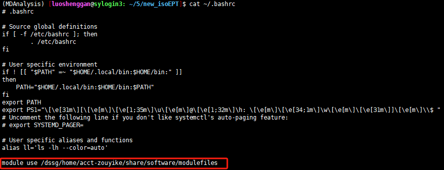
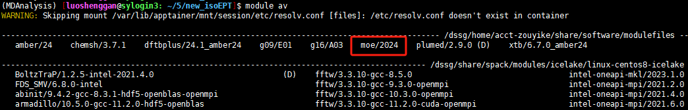
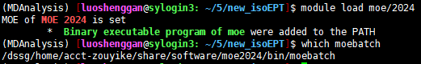
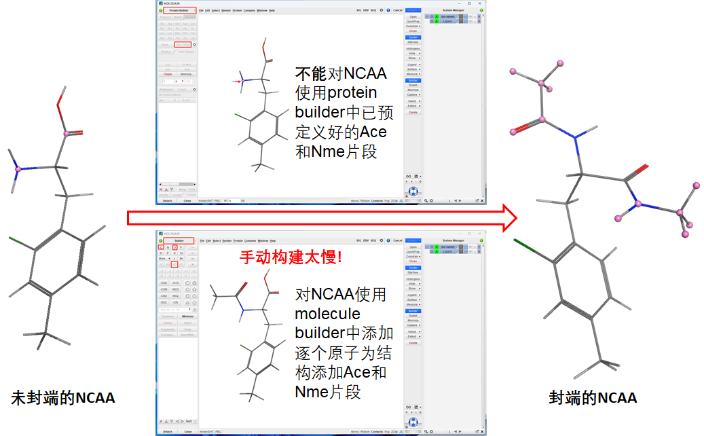
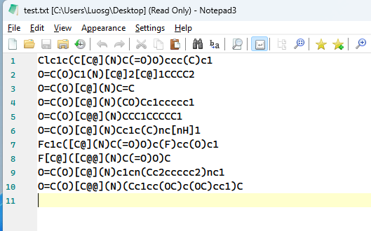
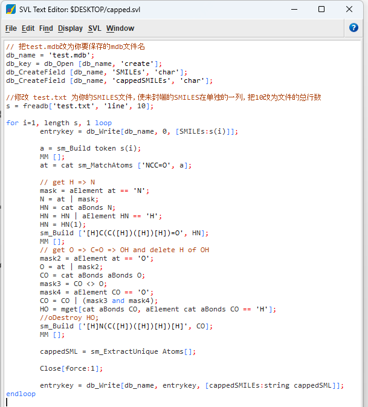
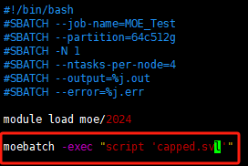
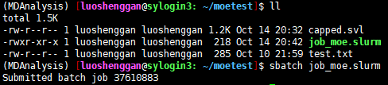
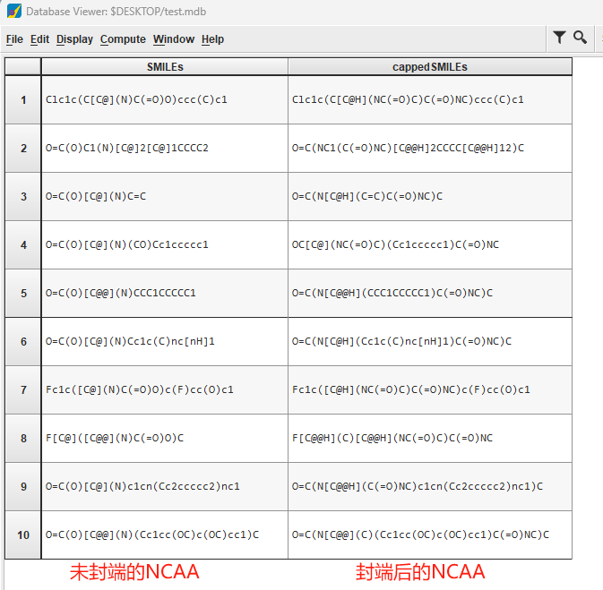

## HPC服务器上提交MOE作业（示例）

注：这里假设你使用**思源一号**服务器进行moe作业的提交，后期加上**PI 2.0**上的提交作业的参考。

### 1. 配置MODULEPATH环境

为了使moe相关程序能够使用，需要在终端先运行以下命令设置MODULEPATH环境：

```bash
module use /dssg/home/acct-zouyike/share/software/modulefiles #思源一号
```

上述命令的作用是使我们自己账户下安装的程序可以通过 `module load`可用，所以应该在我们提交作业的脚本中加入这一行。可以把上面一行命令添加到家目录中的.bashrc文件中，省去每次提交任务都要加入这么长的命令：



然后运行 `source ~/.bashrc`（或者重新打开一个终端）再运行 `module av`可以看到moe可以通过module加载了：

注：可能你使用其他软件（如Amber）时已经进行上述设置，那么请略过这一步。

### 2. 加载MOE环境

运行如下命令加载moe:

```bash
module load moe/2024               #思源一号
```



### 3. 准备moe作业数据

3.1 示例作业的目标：假设一个文件有大量非天然AA的SMILES，我们需要把它导入到MOE并进行结构修饰（如加帽）得到修饰后的SMILES，,并把它们保存为mdb文件，这些结果后续可用于计算多种描述符性质。



如果我们只有几百个或者几十个，那么我们可以直接在GUI界面通过鼠标点击进行人工建模，但是如果有上万个，那肯定需要更高效的方法去完成这些大量重复的工作，SVL(https://www.chemcomp.com/moe/help/2024/CCG_Courses/(Course)_MOE_2024_(I)_Introduction_to_SVL.svlx)脚本是我们的救星！

3.2 示例作业所需的数据：

   test.txt:包含未封端的SMILES（示例中只包含10个）



   capped.svl: 包含svl运行命令



### 4. 提交作业脚本

4.1 准备作业脚本，保存为job_moe.slurm文件，作用脚本中包含以下内容：

```bash
#!/bin/bash
#SBATCH --job-name=MOE_Test
#SBATCH --partition=64c512g
#SBATCH -N 1 
#SBATCH --ntasks-per-node=4
#SBATCH --output=%j.out
#SBATCH --error=%j.err

module load moe/2024

moebatch -exec "script 'capped.svl'"   #MOE运行作业
```



4.2 提交作业脚本：

```bash
sbatch job_moe.slurm
```



4.3 下载test.mdb到本地用moe打开查看结果


