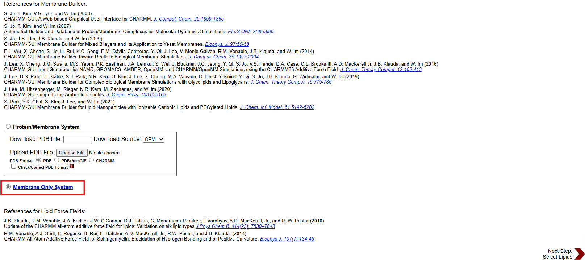
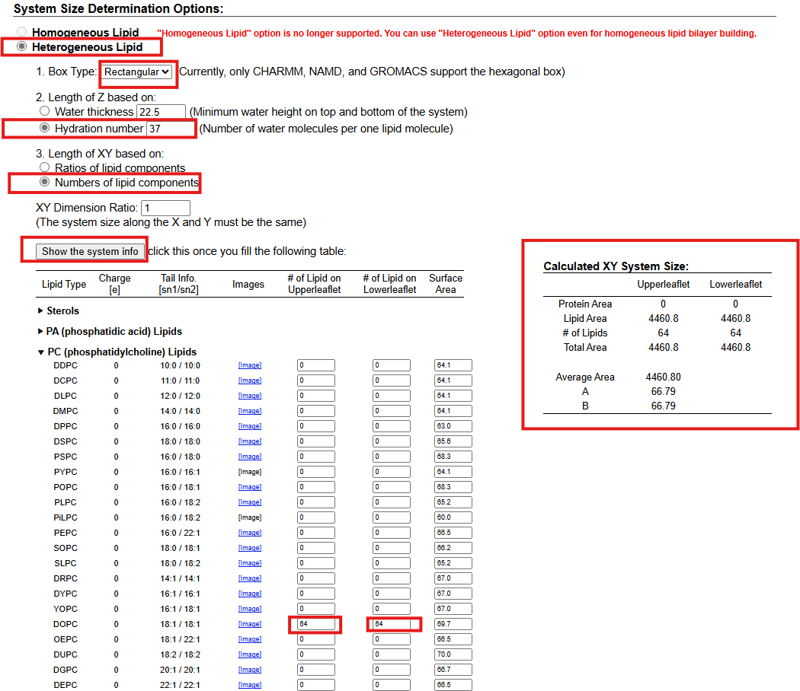
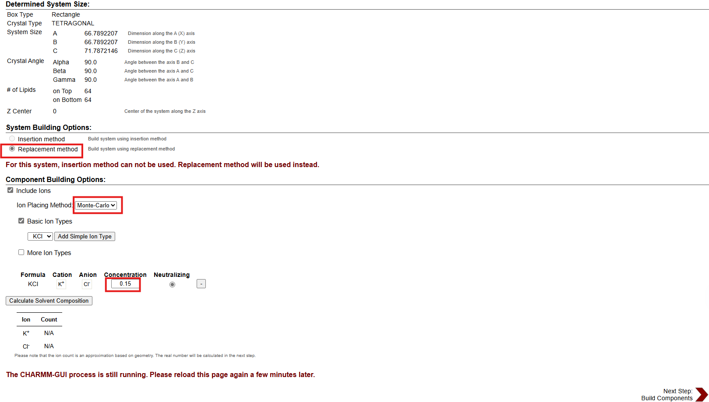
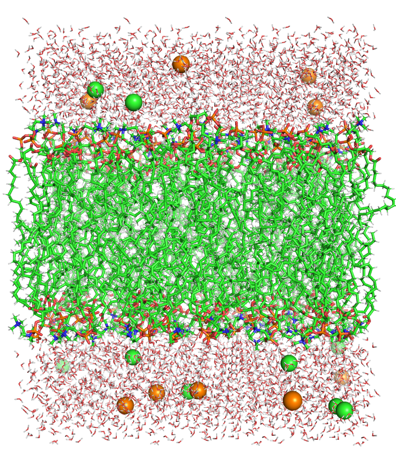

In this tutorial, we present a step-by-step guide to setting up a lipid bilayer system with Lipid21 force field. you will generate a lipid bilayer structure using both the CHARMM-GUI web site and packmol-memgen tool in AmberTools package. 

Note: For CHARMM-GUI web site, we assume you have an account to login.

### **1. CHARMM-GUI**

In this tutorial, you will generate a lipid bilayer structure using the CHARMM-GUI web site, and then convert that PDB formatted file to a file formatted for Amber's preparatory program LEaP. For simplicity, you will use the web based CHARMM-GUI to build an initial lipid bilayer structure. For this tutorial, you will build a simple DOPC lipid bilayer with 128 lipids and use the Lipid21 force field for production MD.

Go to the [**CHARMM-GUI Lipid Builder**](http://www.charmm-gui.org/?doc=input/membrane.bilayer)

**Step 1. Membrane Builder**
Choose "**Membrane Only System**", and then click "Next Step"



**Step 2. System Size Determination**
Choose a "**Heterogeneous Lipid**" system.

Choose a "**Rectangular**" box type. Your system will be **rectangular** and periodic in the X, Y, and Z dimensions. You will be simulating a patch of bilayer with periodic boundary conditions.

Choose an appropriate **hydration number** for your lipid type to define the box Z length. This is important for a properly solvated bilayer system. It is suggested that you review the literature for appropriate hydration numbers for various lipids.
For DOPC, use "**37**" waters per lipid, in excess of the experimental 32.8 waters per lipid (Kucerka, N.; Tristram-Nagle, S; Nagle, J. J. Membrane Biol. 2005, 208, 193-202).

Select "**Numbers of lipid components**' for your system to define the box XY length. This will create a system based on the surface area per lipid. Now enter the "**# of Lipid on Upperleaflet**" and "**# of Lipid on Lowerleaflet**". See the CHARMM-GUI table below for a list of currently supported CHARMM-GUI lipids. For DOPC, set "**64**" on the lower leaflet and "**64**" on the upper leaflet.

Click "**Show the system info**" and verify the system properties are correct. Continue to the next step.



**Step 3. Component Building Options**
Depending on your lipid type and interfacial environment, you will want to include an ion concentration. It is important to include ions due to the inherent charge of the lipid head groups and their interaction with water solvent. Some systems may have special ionic concentration requirements: for example in protein ion channel systems.

For DOPC, set the ion concentration at "**0.15**" M "**KCl**". Choose the "**Monte-Carlo**" ion placing method. Continue to the next step. 



**Step 4. Building Ion and Waterbox**

The next two steps build the lipid bilayer system into a single structure file. Click "**Next Step**" to generate ions and the water box.

**Step 5. Assemble Generated Components**

Membrane components are generated. Click "**Next Step**" to assemble those components together.

**Step 6. Determine System Size and Equilibration Options**

At this point, the generated lipid, waters, and ions have been combined into **a single structure PDB** file (**step5_assembly.pdb**). Download the *charmm-gui.tgz* file and save it to your computer. We just need the PDB file "**step5_assembly.pdb**" from this step. So we don't need to click "**Next Step**" to generate equilibration and dynamics inputs.

**step5_assembly.pdb**

From the charmm-gui.tgz file, the only file needed is the assembled PDB file **step5_assembly.pdb**. This file should have the lipid bilayer, the water molecules, and included ions. It is important to verify all chosen components are present. Extract step5_assembly.pdb and save to your working directory.



**Currently Supported CHARMM-GUI Lipids with Amber Lipid Force Field**

| CHARMM-GUI Lipid | Lipid Residue 1 | Lipid Residue 2 | Lipid Residue 3 |
| ---------------- | --------------- | --------------- | --------------- |
| DLPC             | LA              | PC              | LA              |
| DMPC             | MY              | PC              | MY              |
| DPPC             | PA              | PC              | PA              |
| DOPC             | OL              | PC              | OL              |
| POPC*            | PA              | PC              | OL              |
| DLPE             | LA              | PE              | LA              |
| DMPE             | MY              | PE              | MY              |
| DPPE             | PA              | PE              | PA              |
| DOPE             | OL              | PE              | OL              |
| POPE*            | PA              | PE              | OL              |

**Amber Lipid Force Field PDB Format**

Now you have an initial lipid bilayer PDB file. However, there is no standard for structuring lipid PDB files. 

From the introduction, we know Amber Lipid force field format as follows: The lipid is split into three "residues": two tail groups and one head group. Each residue in Lipid force field has a specific residue name, atom names, and atom types. In a Lipid force field PDB file, a phospholipid molecule is listed as a chain of three lipid residues in specific order: sn-1 tail group, head, sn-2 tail group. Each molecule consisting of a chain of three residues must be ended with a TER card.

**Amber LIPID force field residues' PDB format for LEaP**

| Lipid 1      | sn-1 tial residue  |
| ------------ | ------------------ |
|              | head group residue |
|              | sn-2 tail residue  |
|              | TER card           |
| **Lipid 2** | sn-1 tail residue  |
|              | head group reisdue |
|              | sn-2 tail residue  |
|              | TER card           |
| ...          | ...                |

The CHARMM-GUI PDB formatted file must be reformatted to file that follows the Amber Lipid force field format that LEaP expects.

**charmmlipid2amber.py**

charmmlipid2amber.py is a robust residue and atom renaming and reordering script available with AmberTools. It is used here to convert the CHARMM-GUI PDB format structures into a PDB format that can be read with LEaP and Amber Lipid force field.

Now, to convert the CHARMM-GUI formatted PDB file to the Amber Lipid force field formatted PDB file, use the script charmmlipid2amber.py.

**charmmlipid2amber.py usage:**

```bash
charmmlipid2amber.py -i input_structure.pdb [-c substitution_definitions.csv] -o output_structure.pdb
# input_structure.pdb is the CHARMM-GUI formatted PDB file and output_structure.pdb is the Amber Lipid force field formatted PDB file to be loaded with LEaP.
```

For the 128 lipid DOPC system, convert the PDB file:

```bash
charmmlipid2amber.py -i step5_assembly.pdb -o DOPC_128.pdb
# or the following command get same results
charmmlipid2amber.py -i step5_assembly.pdb -c $AMBERHOME/dat/charmmlipid2amber/charmmlipid2amber.csv -o DOPC_128.pdb
```

###### **DOPC_128.pdb**

After the script completes processing the PDB file, you should have a file DOPC_128.pdb ready to be loaded into LEaP.


### **Estimate Periodic Box Size**

Due to the nature in which CHARMM-GUI builds lipid bilayers, there will be lipids extending beyond the solvation layers in the X and Y dimensions. It is possible to better estimate the periodic box dimensions by using the water molecules' coordinates for this measurement. This can be manually measured using a PDB structure viewer like VMD.

A simple bash/VMD script "**vmd_box_dims.sh**" is provided here to measure the periodic box dimensions here:

```bash
#!/bin/bash

###############################################################################
# NAME
#   vmd_box_dims.sh
# AUTHOR
#   Benjamin D. Madej
# SYNOPSIS
#
# DESCRIPTION
#   Measures the distance between the maximum and minimum coordinates of the
#   PDB structure in the X, Y, and Z dimensions
# OPTIONS
#   -i
#     input_structure.pdb
#       PDB format molecular structure to be read by VMD
#   -s
#     vmd_selection
#       Text used for selecting atoms in VMD to measure box dimensions
###############################################################################

while getopts ":i:s:" opt; do
  case $opt in
    i)
      input_structure=$OPTARG
      ;;
    s)
      vmd_selection=$OPTARG
      ;;
  esac
done

cat << EOF > water_box_dims.tcl
mol new $input_structure
set sel [ atomselect top "$vmd_selection" ]
set dims [ measure minmax \$sel ]
puts "Dimensions: \$dims"
quit
EOF

vmd -dispdev text -nt -e water_box_dims.tcl > water_box_dims.txt

x_min=`grep Dimensions water_box_dims.txt | awk '{print $2}' | sed 's/{//'`
y_min=`grep Dimensions water_box_dims.txt | awk '{print $3}'`
z_min=`grep Dimensions water_box_dims.txt | awk '{print $4}' | sed 's/}//'`
x_max=`grep Dimensions water_box_dims.txt | awk '{print $5}' | sed 's/{//'`
y_max=`grep Dimensions water_box_dims.txt | awk '{print $6}'`
z_max=`grep Dimensions water_box_dims.txt | awk '{print $7}' | sed 's/}//'`
x_diff=`echo "$x_max - $x_min" | bc`
y_diff=`echo "$y_max - $y_min" | bc`
z_diff=`echo "$z_max - $z_min" | bc`
echo $x_diff, $y_diff, $z_diff
rm water_box_dims.tcl water_box_dims.txt
```

**vmd_box_dims.sh usage:**

```bash
vmd_box_dims.sh -i input_structure.pdb -s vmd_selection
```

Now calculate your box dimensions from the water molecules:

```bash
vmd_box_dims.sh -i DOPC_128.pdb -s water # 68.08300018310547, 68.05400085449219, 79.50899887084961
```

### **LEaP**

In this section, you will load the file named **DOPC_128.pdb** into LEaP to define the topology and parameters for the lipid residues making up each phospholipid. Use this method to prepare an Amber parameter topology file and initial coordinate file.

We first need to prepare a input file "**leap.in**" for LEaP:

```bash
source leaprc.lipid21
source leaprc.protein.ff19SB
source leaprc.water.tip3p
DOPC = loadpdb DOPC_128.pdb
set DOPC box { 68.08300018310547 68.05400085449219 79.50899887084961 }
saveAmberParm DOPC DOPC_128.prmtop DOPC_128.inpcrd
quit
```

We load the force fields in first 3 lines: source the force fields we want to use. Lipid21 is designed to be compatible with the other pairwise-additive Amber force fields. 

Then, the 4th line load the lipid structure file into a unit: with the processed file, DOPC_128.pdb, LEaP will load the structure, split the lipids into three units, and assign atom types.

**Note**

*There will be warnings about lipids being split into different residues. This is normal LEaP behavior. The residue sequence number may not correspond to the residues in your PDB file.*

The 5th line add the periodic box to the system: we use the periodic box size as measured from the water molecules in our structure using VMD.

Last, save the Amber prmtop parameter and topology file and the inpcrd initial coordinate file for the molecular dynamics simulation.

**Note**

*Pay close attention to any error messages that LEaP provides when saving the parameter and topology file. Verify that there are no missing parameters.*

At this point the necessary files have been generated to run the actual simulation.  Quit LEaP and verify that the prmtop and inpcrd files were created.
