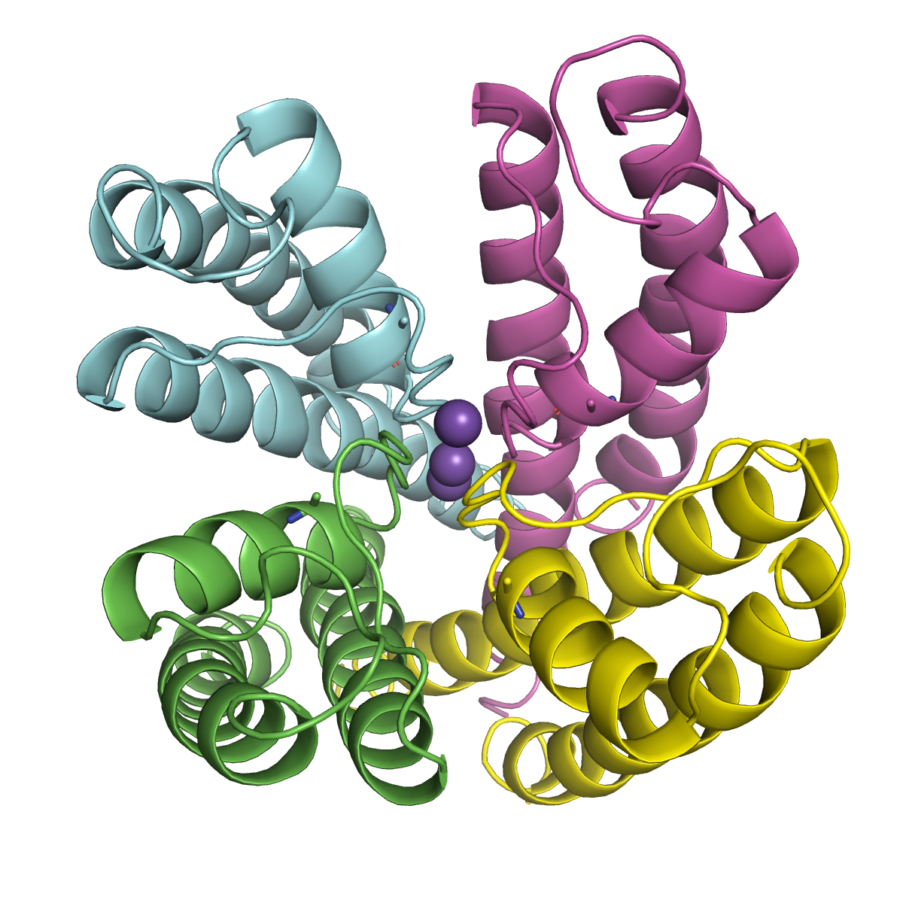

In this case, we will be packing the potassium channel KcsA (PDB: 1BL8).

1. Determining the protonation states.
   Issue following command to download the PDB file

   ```bash
   wget https://files.rcsb.org/download/1BL8.pdb
   ```

   Open the PDB file with your PyMol and issue the following command will show the structure

   

   ```bash
   bg white
   space cmyk
   set ray_shadow, 0
   set opaque_background, 0

   as cartoon
   show spheres, resn K

   set sphere_scale, 0.5, resn K
   util.cbc 1bl8 and e. C, 7, quiet=1

   show sticks, resi 71

   ### cut below here and paste into script ###
   set_view (\
        0.725519359,    0.402470559,   -0.558232248,\
        0.600737035,   -0.766106486,    0.228429049,\
       -0.335732192,   -0.501084864,   -0.797612011,\
       -0.001348486,    0.000199109, -156.212524414,\
       73.138122559,   25.062622070,   18.763792038,\
       44.564746857,  267.892242432,  -20.000000000 )
   ### cut above here and paste into script ###
   ```

   or you can double-click the file "Show1BL8.pml" to automatically show the structue.

   KcsA channel has four chains (colored with different colors in above figures). From the literature, we know that E71 (see the stick representations in the above figure) of the KcsA channel is in a protonated state(DOI: [10.1073/pnas.1211900109](https://doi.org/10.1073/pnas.1211900109)). We also find that there are also missing side chain atoms in E71. We can use LEaP add them automatically.
2. Packing the channel into a membrane.

   Two ways to set proper protonation states (residue names, or caps) in the PDB file.

   First, Based on nomenclature of Amber, we need to change the residue name of E71 to "GLH" (the Amber residue name for a protonated GLU), before packing the protein. The issue with this is that in PACKMOL-Memgen, proteins are by default deprotonated and protonated again with **reduce** , which currently does not recognize residue names of alternate protonation states, and will add wrongly named hydrogens. This will work as long as you remove the wrongly added hydrogens after the packing and before using LEaP (in any case, you will get an error message from LEaP pointing you to the wrong hydrogens if you try).

   An alternative is to run the packing without changing the residues, and change them after the packing:

   ```bash
   packmol-memgen --pdb 1BL8.pdb --lipids DOPE:DOPG --ratio 3:1 --keepligs
   ```

where,

| options            | functions                                                                                                   |
| ------------------ | ----------------------------------------------------------------------------------------------------------- |
| --pdb              | flag to specify the protein to include in the packing                                                       |
| --lipids DOPE:DOPG | specifies the lipids to use                                                                                 |
| --ration 3:1       | sets the ratio of DOPE with respect to DOPG. The order depends on the order used in --lipids                |
| --keepligs         | will keep non-proteic molecules (potassium and water in this case) in the PDB, usually removed by memembed. |

After the previous command finishes successfully, you will have the packed pdb bilayer_1BL8.pdb. You can inspect it with you preferred molecular viewer and check how the generated membrane looks like, and if any lipid is overlapping heavily with the protein, or if any of them got trapped in the protein channel. If you open the file with a text editor, you will notice that the residue numbers were changed; residues 71 in each chain, are now numbered 49, 146, 243 and 340. We can rename them to GLH with the following command:

```bash
for i in "49 146 243 340"; do
	sed -i "/GLU . $i/s/GLU/GLH/g" bilayer_1BL8.pdb; 
done
```

**WARNING!** Please note that this step is completely system specific. It could be that your protein does not require any special treatment, or that you have all hydrogens properly added beforehand, in which case you can directly parametrize it. In this case I am assuming that I start from a not-ready-to-go protein from the PDB for instruction purposes! The way you prepare your own protein will depend completely on you.

Please check the file after executing the commands and see that the residues were properly renamed. It should look something like this.


Now, we can use LEaP to generate the topology and MD input coordinates. You can do this with your own script, or use the suggestion generated by PACKMOL-Memgen:

```bash
packmol-memgen --pdb 1BL8.pdb --lipids DOPE:DOPG --ratio 3:1 --keepligs --parametrize
```

You might have noticed that this is the same command as before, but with the included `--parametrize` flag. The script will identify that `bilayer_1BL8.pdb` is already in the folder, and will skip the packing process, and go straight to the parametrization step. If you want to be able to modify the LEaP script used, you can also run the script with the `--keep` flag, which will leave all the intermediate include including the leap.in file. If everything went well, you will end up with the following additional include:

bilayer_1BL8_lipid.pdb        PDB file made by LEaP
bilayer_1BL8_lipid.top         Topology file.
bilayer_1BL8_lipid.crd         Coordinate input file.

You can now run the minimization and equilibration protocol using these files.
